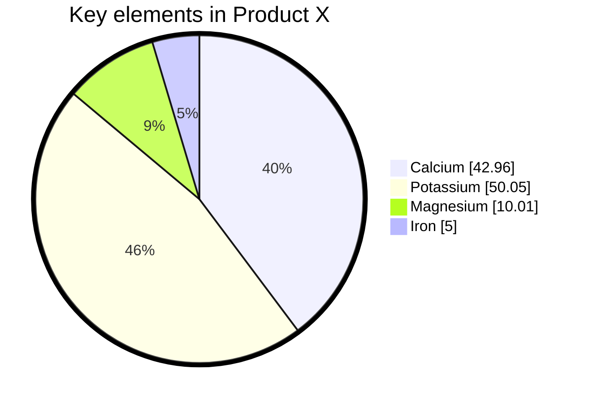

Voici votre nouveau *coffre*.

Notez quelque chose, [[créez un lien]], ou essayez [l'importateur](https://help.obsidian.md/Plugins/Importer)!

Lorsque vous serez prêt, supprimez cette note et faites ce coffre vôtre.

![[Img_20251103_CA_Helper_Inoi.png]]

Azertyuiop
